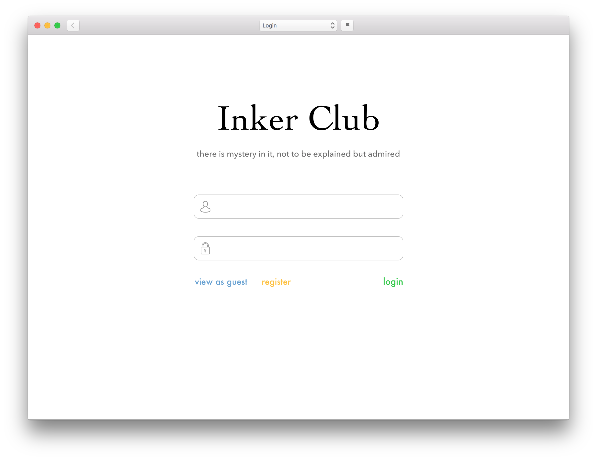
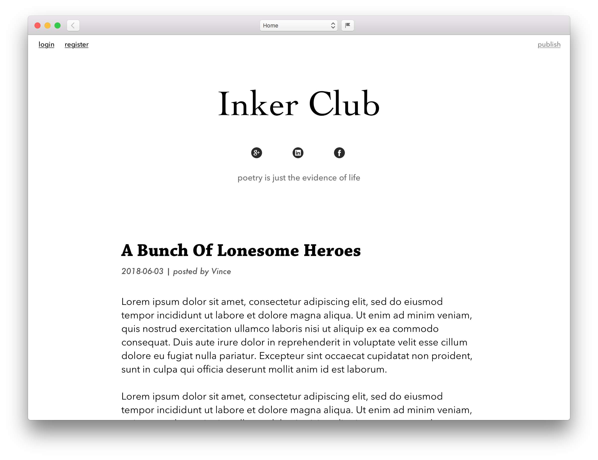
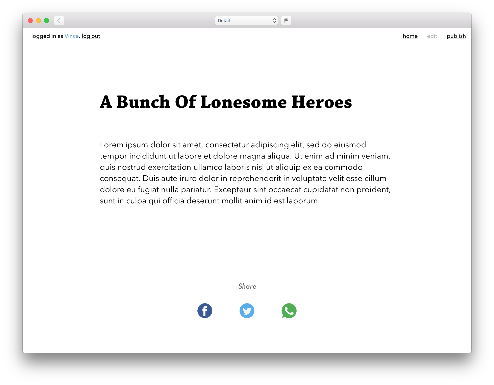

# Inker Club

A text sharing platform.

### Design

*login page*


*home page*


*entry page*


### Dependencies
* c3p0-0.9.5.2.jar
* commons-dbutils-1.7.jar
* mysql-connector-java-8.0.11.jar
* mchange-commons-java-0.2.11.jar

* jQuery

### Create Database

```mysql
CREATE SCHEMA InkerClubDB;

USE InkerClubDB;

CREATE TABLE entry (
	e_id INT PRIMARY KEY NOT NULL AUTO_INCREMENT,
	title VARCHAR(255) NOT NULL,
	date DATETIME NOT NULL,
	author VARCHAR(255) NOT NULL,
	content TEXT NOT NULL
);

CREATE TABLE user (
	u_id INT PRIMARY KEY NOT NULL AUTO_INCREMENT,
	name VARCHAR(10) NOT NULL UNIQUE,
	password VARCHAR(20) NOT NULL
);

INSERT INTO entry (title, date, author, content) VALUES ('A Bunch Of Lonesome Heroes', '2018-06-06 10:00:00', 'Vince', 'Lorem ipsum dolor sit amet, consectetur adipiscing elit, sed do eiusmod tempor incididunt ut labore et dolore magna aliqua. Ut enim ad minim veniam, quis nostrud exercitation ullamco laboris nisi ut aliquip ex ea commodo consequat. Duis aute irure dolor in reprehenderit in voluptate velit esse cillum dolore eu fugiat nulla pariatur. Excepteur sint occaecat cupidatat non proident, sunt in culpa qui officia deserunt mollit anim id est laborum.');
INSERT INTO entry (title, date, author, content) VALUES ('Love Minis Zero / No Limits', '2018-06-05 10:00:00', 'Dawson', 'Lorem ipsum dolor sit amet, consectetur adipiscing elit, sed do eiusmod tempor incididunt ut labore et dolore magna aliqua. Ut enim ad minim veniam, quis nostrud exercitation ullamco laboris nisi ut aliquip ex ea commodo consequat. Duis aute irure dolor in reprehenderit in voluptate velit esse cillum dolore eu fugiat nulla pariatur. Excepteur sint occaecat cupidatat non proident, sunt in culpa qui officia deserunt mollit anim id est laborum.');

INSERT INTO user (name, password) VALUES ('Vince', 'vincepassword');
INSERT INTO user (name, password) VALUES ('Dawson', 'dawsonpassword');
```

